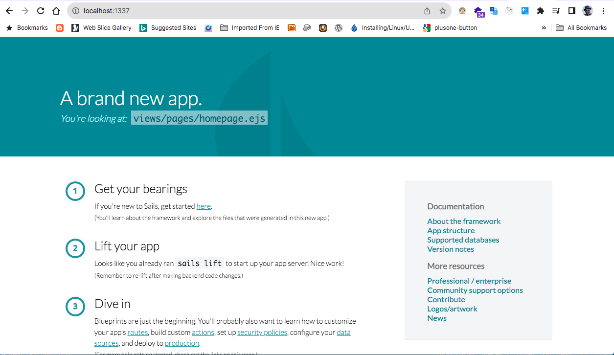

# Hello World
As with any new programming language, a "Hello World" gets us up and running very quickly.
You are already prepared to write your first Sails.js application.

## Generate a new Sails.js project
At this point, you should have already installed `NodeJS` and `Sails.js` framework. If not please
go back to [Installation](./installation) and make sure you understood the [Requisites](./requisites).

To generate a new Sails.js project, we need to use the `sails new` command.

```
sails new hello-world
```

Sails will ask you to choose a template for your new sails app;

```
Choose a template for your new Sails app:
 1. Web App  ·  Extensible project with auth, login, & password recovery
 2. Empty    ·  An empty Sails app, yours to configure
 (type "?" for help, or <CTRL+C> to cancel)
```

Since we just want to get started quickly, select `option 2 (Empty. An empty sails app, yours to configure)`;

Next, sails will install required dependencies. This might take a few minutes. Be patient
```
 info: Installing dependencies...
 Press CTRL+C to cancel.
(to skip this step in the future, use --fast)
```

Once the dependencie are installed, navigate to the newly created folder `hello-world/`
```
cd hello-world/
```
Then start the sails app;
```
sails lift
```

You should see the following output;
```
info: Starting app...

 info: 
 info:                .-..-.
 info: 
 info:    Sails              <|    .-..-.
 info:    v1.5.14             |\
 info:                       /|.\
 info:                      / || \
 info:                    ,'  |'  \
 info:                 .-'.-==|/_--'
 info:                 `--'-------' 
 info:    __---___--___---___--___---___--___
 info:  ____---___--___---___--___---___--___-__
 info: 
 info: Server lifted in `/Users/mwangigikoyo/hello-world`
 info: To shut down Sails, press <CTRL> + C at any time.
 info: Read more at https://sailsjs.com/support.

debug: -------------------------------------------------------
debug: :: Thu Feb 06 2025 23:30:46 GMT+0300 (East Africa Time)

debug: Environment : development
debug: Port        : 1337
debug: Local       : http://localhost:1337
debug: -------------------------------------------------------
```

As you can see, sails by default will bind to `http://localhost:1337`

Open the browser and navigate to `http://localhost:1337`.

The page below loads;



Congratulations! You have successfully run your first Sails.js application.
Next, we'll cover the [Structure of a SailsJS application](./sailsjs-application-structure)

