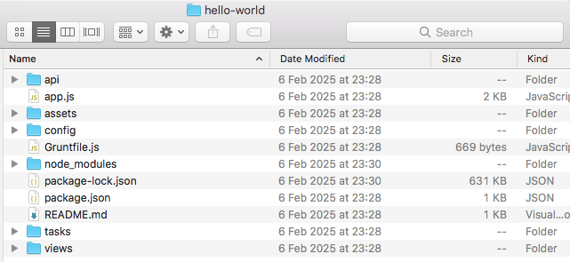

# Sails JS Application Structure

Below is the default folder structure for an empty sails js application.
Empty because we selected option 2 (<code>2. Empty    ·  An empty Sails app, yours to configure</code>) during creation (<code>sails new hello-world</code>)

  
Below is a high level description of each folder within an empty  application.
 
 
<table>
    <thead>
        <tr>
            <th>Folder Name</th>
            <th>Path</th>
            <th>Description</th>
        </tr>
    </thead>
    <tbody>
        <tr>
            <td>api</td>
            <td>./api</td>
            <td>Contains the core components of your application such as coltrollers, models, policies, services, helpers</td>
        </tr>
        <tr>
            <td></td>
            <td>./api/controllers</td>
            <td colspan="2">Houses controller files that handle incoming requests and define application logic.</td>
        </tr>
        <tr>
            <td></td>
            <td>./api/models</td>
            <td colspan="2">Defines the data structures and interactions with the database.</td>
        </tr>
        <tr>
            <td></td>
            <td>./api/policies</td>
            <td colspan="2">Contains policy files used for authorization and access control.</td>
        </tr>
        <tr>
            <td></td>
            <td>./api/service</td>
            <td colspan="2">Includes service modules that encapsulate reusable business logic.</td>
        </tr>
        <tr>
            <td></td>
            <td>./api/helpers</td>
            <td colspan="2">Stores helper functions that can be used across controllers, models, and views.</td>
        </tr>
        <tr>
            <td>assets</td>
            <td>./assets</td>
            <td>
                

                Serves as the location for static files like JavaScript, CSS, and images. These files are processed and made accessible to the public. 
                
 
                 
                
<b>Key Features of the <code>assets/</code> Folder;</b>

                <ul>
                    <li>
                        
                        <b>Static File Hosting:</b> Files placed in the assets/ directory are automatically processed and served as static assets. For example, an image located at <code>assets/images/logo.png</code> would be accessible via <code>http://localhost:1337/images/logo.png</code> when the app is running.
                        
                    </li>
                    <li>
                        <b>Automatic Processing:</b> Upon lifting the application, Sails processes the contents of the <code>assets/</code> folder, handling tasks such as pre-processing stylesheets (e.g., LESS, SASS) or compiling templates. The processed files are then stored in a temporary <code>.tmp/public/</code> directory, which Sails uses to serve the assets at runtime. 
                    </li>
                    <li>
                        <b>Organizational Structure:</b> While you have the flexibility to organize the assets/ folder as you see fit, Sails provides default subdirectories for common asset types:
                        <ul>
                            <li><b>images/:</b> For image files.</li>
                            <li><b>js/:</b>For client-side JavaScript files.</li>
                            <li><b>styles/:</b>For CSS or pre-processor files like LESS and SASS.</li>
                            <li><b>templates/:</b>For client-side HTML templates.</li>
                        </ul>
                    </li>
                </ul>
            </td>
        </tr>
        <tr>
            <td>config</td>
            <td>./config</td>
            <td>
                
Contains configuration files for various aspects of the application, such as routes, database connections, and environment settings.

                
<b>Key Features of the <code>config/</code> Folder:</b> 

                    <ul>
                        <li>
                            <b>Centralized Configuration Management: </b> The config/ directory contains files that define settings for models, views, controllers, routes, and more. This centralized approach simplifies the management and modification of application behavior.
                        </li>
                        <li>
                            <b>Environment-Specific Settings: </b> Within the config/ folder, there's an <code>env/</code> subdirectory designed for environment-specific configurations. For instance, <code>config/env/production.js</code> holds settings that override defaults when the application runs in a production environment. 
                            The development configuration file isn't created by default. 
                            You can copy <code>config/env/production.js</code> and from it, create <code>config/env/development.js</code> for your development environment.
                        </li>
                        <li>
                            <b>Dynamic Configuration Loading:</b> Sails.js automatically loads and merges configuration files from the <code>config/</code> directory during the application lift process. This dynamic loading ensures that settings from various files are combined into a single configuration object (<code>sails.config</code>), which the application can reference at runtime.
                        </li>
                        <li>
                            <b>Flexibility in File Organization:</b> While Sails.js provides default configuration files, developers have the flexibility to create custom configuration files or organize settings across multiple files as needed. The framework recursively loads all files in the <code>config/</code> directory, allowing for a modular and organized configuration structure.
                        </li>
                        <li>
                            <b>Flexibility in File Organization:</b> While Sails.js provides default configuration files, developers have the flexibility to create custom configuration files or organize settings across multiple files as needed. The framework recursively loads all files in the <code>config/</code> directory, allowing for a modular and organized configuration structure.
                        </li>
                    </ul>
                    
By effectively utilizing the <code>config/</code> folder, developers can tailor a Sails.js application to meet specific needs, manage environment-specific settings, and maintain a clear separation of concerns within the application's architecture.

                    
                    
            </td>
        </tr>
        <tr>
            <td>views</td>
            <td>./views</td>
            <td>
                
Holds the view templates (e.g., EJS files) that define the HTML structure rendered to users.

                
<b>Key Features of the <code>views/</code> Folder:</b>

                <ul>
                    <li>
                        <b>Default Location:</b> The <code>views/</code> directory is situated at the root of your Sails application and contains all the view templates. This path is configurable, allowing customization based on project requirements.
                    </li>
                    <li>
                        <b>Organizational Structure:</b> Within the <code>views/</code> folder, you can organize templates into subdirectories. For instance, the <code>views/pages/</code> subdirectory is commonly used to store individual page templates, including the homepage and other specific pages.
                    </li>
                    <li>
                        <b>Layouts:</b> Sails supports the use of layout files, which are templates that wrap around other views to maintain consistent structure across pages. By default, layouts are located in the <code>views/layouts/</code> directory, with <code>views/layouts/layout.ejs</code> serving as the default layout file. This setup can be customized or disabled as needed.
                    </li>
                    <li>
                        <b>Rendering Views:</b> To render a view from a controller action or policy, you can utilize the <code>res.view()</code> method. This method compiles the specified template and sends the resulting HTML as the response. If no specific view is mentioned, Sails defaults to a view based on the controller and action names.
                    </li>
                    <li>
                        <b>Route Mapping:</b> Views can be directly associated with routes in the <code>config/routes.js</code> file. By specifying the path to a view relative to the <code>views/</code> folder, you can define which template should render for a particular route. 
                    </li>
                </ul>
                
Effectively managing the views/ folder and its contents ensures that your Sails.js application delivers dynamic and well-structured HTML responses to users.

            </td>
        </tr>
        <tr>
            <td>.tmp</td>
            <td>./.tmp</td>
            <td> 
                
A temporary directory used by Sails for processing and serving assets. On Unix/Linux based systems, folders whose names start with a dot (.) are usually hidden.

                
Key Features of the <code>.tmp/</code> Folder:

                <ul>
                    <li>
                    <b>Asset Pipeline Integration:</b> The <code>.tmp/public/</code> directory is the actual web root from which Sails serves static files at runtime. This setup enables the framework to manage and serve processed assets efficiently.
                </li>
                <li>
                    <b>Automatic Cleaning:</b> Sails employs tasks, such as the clean task, to remove existing files in the <code>.tmp/public/</code> directory before processing new assets. This ensures that outdated files do not persist and that the served content is up-to-date. 
                </li>
                <li>
                    <b>Dynamic Generation:</b> The <code>.tmp/</code> folder is generated dynamically each time the application is lifted. Consequently, it is not included in version control systems like Git. If the folder is missing or not updating as expected, it may indicate issues with the asset pipeline or task runner configurations.
                </li>
                </ul>
                
Understanding the role of the .tmp/ folder is crucial for effective asset management in Sails.js applications, particularly during development and deployment processes.

            </td>
        </tr>
  </tbody>
</table>
