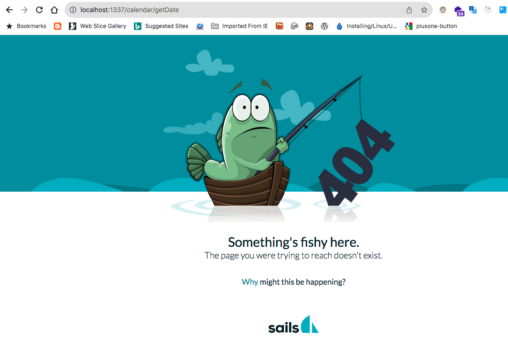

# Controller with Custom Route
In [Exercise 2](./sailsjs-exercise-2), we saw how to create our first controller and access one if it's actions/methods on the browser via it's implicit/automatic route - <code>http://localhost:1337/calendar/getDate</code>.

In this section, let's disable sails from generating implicit/automatic routes.

Go ahead and set the value of <code>actions</code> to <code>false</code> in <code>config/blueprints.js</code>

Re-run the application (<code>CTRL</code> + <code>Z</code>) then <code>npm run start</code>.

Open <code>http://localhost:1337/calendar/getDate</code> on the browser. This time, you will get below default sails error 404 page;



Then, open <code>config/routes.js</code>. It should be looking like this;

```javascript
module.exports.routes = {
  '/': { view: 'pages/homepage' },
  '/home': { view: 'pages/homepage' }
}
```

Add another route <code>'GET /api/*': { controller: 'calendar', action: 'route' }</code> so that the file looks like this;

```javascript
module.exports.routes = {
  '/': { view: 'pages/homepage' },
  '/home': { view: 'pages/homepage' },
  'GET /calendar': { controller: 'calendar', action: 'getDate'  }
}
```

Note that the controller name is <code>http://localhost:1337/calendar</code>. Try access this URL on the browser and you'll see that now we can get today's date printed as before with the implicit/automatic route.


