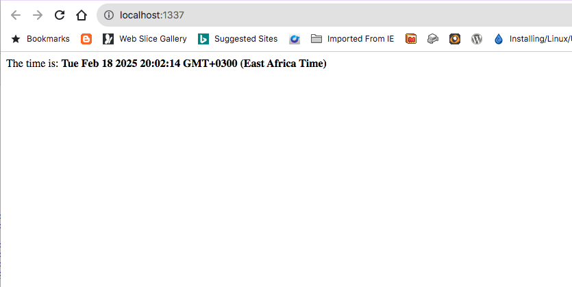

# Exercise 1

Copy the [Hello World](./hello-world) example, or clone from [GitHub](https://github.com/mwangigikonyo/hello-world.git).

Modify the index file -> <code>views/pages/homepage.ejs</code>

Replace it with the following;

```html
    <div>
        The time is: <code><b> <%= new Date() %> <b></code>
    </div>
```

Then build the project;

```
npm run build;
```

Then run the project;
```
npm run start
```

Then open the browser and navigate to <code>http://localhost:1337</code>;

You should now see;




# What have we learned?

This exercise demonstrates two things;
- Modifying the index page of the "hello world" example to show the time.
- We get to understand how to embed javascript code - ``` <%= new Date() %> <b>```

The  ``` <%= ``` and ```%>``` is called <b>escaped output tag</b>.

It evaluates the enclosed JavaScript expression and outputs the result, while automatically escaping any HTML-specific characters to prevent issues like cross-site scripting (XSS).


In contrast, EJS provides the ```<%- %>``` tag for <b>unescaped output</b> This tag evaluates the expression and outputs the result without escaping, allowing HTML content to be rendered as-is. It's crucial to ensure that any data rendered using ``` <%- %> ``` is properly sanitized to prevent security vulnerabilities.

Additionally, EJS offers other tags for different purposes:

<ul>
    <li>
        <p>
            <code>  {'<% %>'} </code> : Scriptlet tag for executing JavaScript code without producing output.
        </p>
    </li>
    <li>
        <code> {'<%# %>'} </code>: Comment tag; content within these tags is not included in the rendered output.
    </li>
    <li>
        <code> {'<%_ %>'}</code> and  <code>{'<% %_>'}</code>: Whitespace-slurping scriptlet tags that remove preceding or trailing whitespace, respectively.
    </li>
</ul>


These tags provide flexibility in embedding and controlling JavaScript code within your EJS templates.