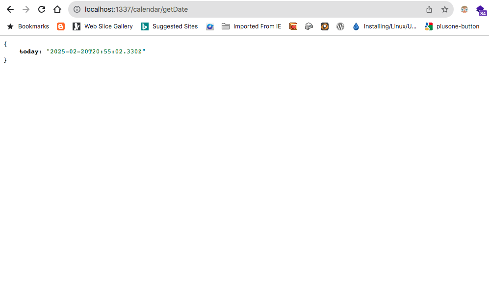

# Controller with Implicit Route
Controllers are basically the "C" or controller in MVC patterns.

They are simply javascript files that contain logic for handling requests and returning responses. 

We shall create a controler on the CLI using sailsjs tool - ```sails generate controller <controller-name>``` tool. Where ```<controller-name>``` is the desired controller name, e.g create our controller called <code>CalendarController</code> we will need to run the following command;

```bash
sais generate controller calendar
```

Note that we did not need to type the whole controller name, instead just ```controller```. The output would look like this;

```bash
sails generate controller calendar
 info: Created a new controller ("calendar") at api/controllers/CalendarController.js!
```

Open the newly generated controller <code>api/controllers/CalendarController.js</code>. It should look like this;

```javascript
/**
 * CalendarController
 *
 * @description :: Server-side actions for handling incoming requests.
 * @help        :: See https://sailsjs.com/docs/concepts/actions
 */

module.exports = {
  
};
```

As you can see, the above is an empty controller. We only see <code>module.exports</code>.

Modify this controller to look as follows;

```javascript
/**
 * CalendarController
 *
 * @description :: Server-side actions for handling incoming requests.
 * @help        :: See https://sailsjs.com/docs/concepts/actions
 */

module.exports = {

    getDate: async function(req, res){
        const today = new Date();
        return res.json({ today });
    }

};
```

Then, restart the sails app (<code>CTRL</code> + <code>Z</code>) where you had started it from on the command line.

Then;

```bash
npm run start
```

Open the browser and navigate to <code>http://localhost:1337/calendar/getDate</code>

You should see below;



Notice that the URL that serves the controller is <code>/calendar/getDate</code>
I know... you'd expect it to be something like <code>/CalendarController/getDate</code> since the file name for the controller is <code>CalendarController</code>.

This is the reason why we say that sails is a <b>convention-over-configuration</b> framework.

This design philosophy means that Sails.js provides sensible default settings and structures, allowing developers to build applications efficiently without extensive configuration. 

This is another confirmation why Sails.js framework is good for a busy commercial environment where rapid development and prototyping is key.

With just one command, we were able to create a controller;

```bash
sais generate controller calendar
```

Then, added a simple function <code>getDate</code>, restarted the application and we were able to access the controller using an [Implicit/Automatic Route](./sailsjs-implicit-routes) on the browser via (<code>http://localhost:1337/calendar/getDate</code>).

This is an implicit <code>actions</code> route that binds routes for every action in your controllers. 

Our controller is called <code>calendar</code> and has one action/method called <code>getDate</code>, so the implicit/automatic route is <b>http://localhost:1337/<code>calendar</code>/<code>getDate</code></b>

If you'd like to disable this behaviour, you can change the value of <code>actions</code> to <code>false</code>. This way, you must define an custom route to this controller function/action.


