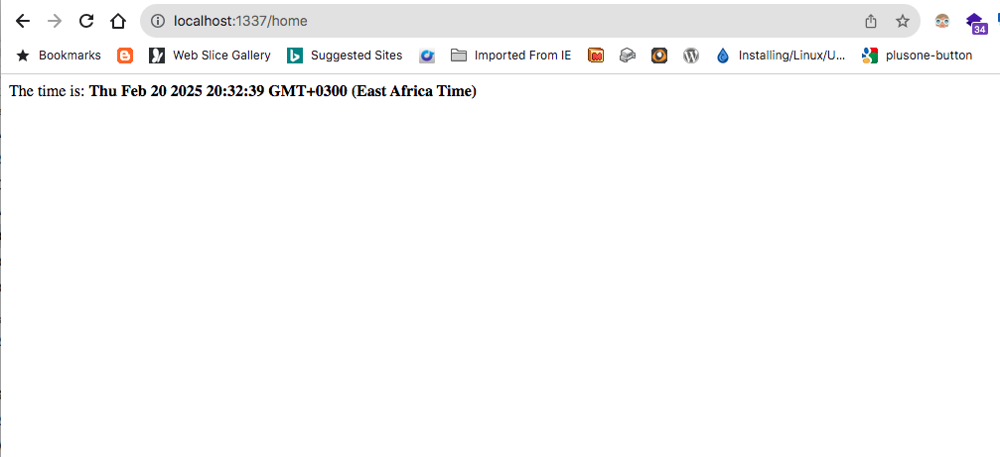

# Routing in Sails JS
Routing allows you to map incoming requests to appropriate controllers, actions or views.

In [Exercise 1](./sailsjs-exercise-1), we modified a view <code>views/pages/homepage.ejs</code> and realised this was our index file.

What if we wanted this page's route to be <code>/home</code>. What would we do?

This is where we would need to create a <b>Custom route</b>.

Custom routes are specified in the <code>config/routes.js</code> file. Each route consists of an address (a combination of HTTP method and URL path) and a target (such as a controller action or view).

Open the configuration file <code>config/routes.js</code>, it should look like this;

```javascript
/**
 * Route Mappings
 * (sails.config.routes)
 *
 * Your routes tell Sails what to do each time it receives a request.
 *
 * For more information on configuring custom routes, check out:
 * https://sailsjs.com/anatomy/config/routes-js
 */

module.exports.routes = {

  /***************************************************************************
  *                                                                          *
  * Make the view located at `views/homepage.ejs` your home page.            *
  *                                                                          *
  * (Alternatively, remove this and add an `index.html` file in your         *
  * `assets` directory)                                                      *
  *                                                                          *
  ***************************************************************************/

  '/': { view: 'pages/homepage' },


  /***************************************************************************
  *                                                                          *
  * More custom routes here...                                               *
  * (See https://sailsjs.com/config/routes for examples.)                    *
  *                                                                          *
  * If a request to a URL doesn't match any of the routes in this file, it   *
  * is matched against "shadow routes" (e.g. blueprint routes).  If it does  *
  * not match any of those, it is matched against static assets.             *
  *                                                                          *
  ***************************************************************************/


};

```

Notice <code>'/': { view: 'pages/homepage' },</code> and how the value of 'view' corresponds to the view (<code>EJS</code>) file - <code>views/pages/homepage.ejs</code>.

This gives you a hint that the root route <code>'/'</code> is routed to the (<code>EJS</code>) file - <code>views/pages/homepage.ejs</code>.

Let's change the file so that it looks like this; Basically, remove the code comments in the file. Don't worry, you can always get this documenation back with every new project - helps keep you well informed on the capabilities of the framework;


```
module.exports.routes = {
  '/': { view: 'pages/homepage' }
}
```


So, let's add another route <code>/home</code> by changing the default route <code>'/'</code> to <code>'/home'</code> so that it looks like this;


```
module.exports.routes = {
  '/': { view: 'pages/homepage' },
  '/home': { view: 'pages/homepage' }
}
```

Open the browser, and open the link <code>http://localhost:1337/home</code>.

As you can see, the content of <code>views/pages/homepage.ejs</code> is served by the new route <code>/home</code>;




There are two types of Sails JS routes;
<ol>
  <li><b>Custom (Explicit) Routes</b>: Manually defined routes that map specific URLs to designated targets, such as controller actions or views.</li>
  <li><b>Automatic (Implicit) Routes</b>: Routes that Sails.js binds automatically, including blueprint routes and asset routes.</li>
</ol>

In the small exercise above, you defined a Custom (Explicit) Route.
This means, that you define a route yourself, as well as which controller, action, or method it takes the HTTP request to.

In the next section, we'll dive deeper into routing through advancing our "hello world" project. Don't delete it yet.
